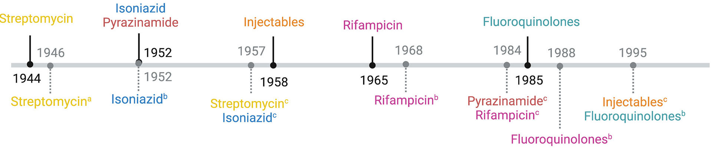
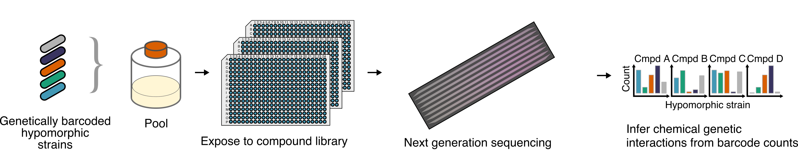
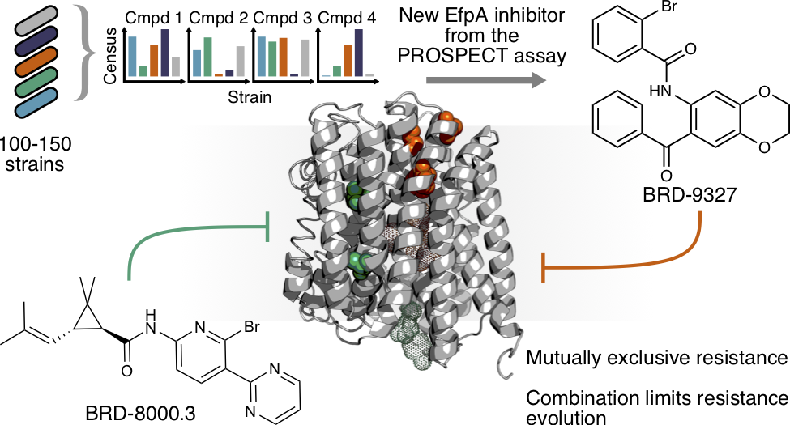
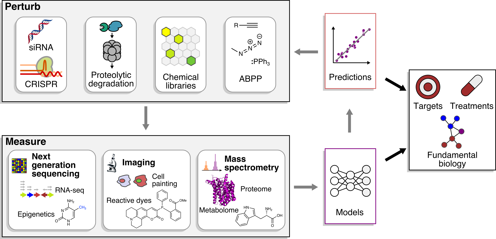
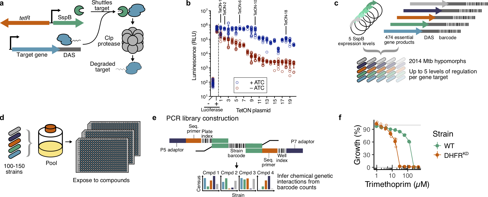

# Publications

If you need access to a PDF, get in [contact](Contact).

## While at the Francis Crick Institute (2021–)

:::{card} 
[Chemical Validation of Mycobacterium tuberculosis Phosphopantetheine Adenylyltransferase Using Fragment Linking and CRISPR Interference](https://doi.org/10.1002/anie.202300221) \
Jamal El Bakali, Michal Blaszczyk, **_Joanna C Evans_**, Jennifer A Boland, William J McCarthy, Imam Fathoni, Marcio V B Dias, **Eachan O Johnson**, Anthony G Coyne, Valerie Mizrahi, Tom L Blundell, Chris Abell, Christina Spry \
_Frontiers in Cellular and Infection Microbiology_, Oct 2022, 12: 954074 \
PubMed ID: [36757665](https://pubmed.ncbi.nlm.nih.gov/36757665/)
:::

:::{card} 
[Evolution of Mycobacterium tuberculosis drug resistance in the genomic era](https://doi.org/10.3389/fcimb.2022.954074) \
**_Nimmo C, Millard J, Faulkner V, Monteserin J, Pugh H_**, **Johnson EO** \
_Frontiers in Cellular and Infection Microbiology_, Oct 2022, 12: 954074 \
PubMed ID: [36275027](https://pubmed.ncbi.nlm.nih.gov/36275027/)

:::

## While at the Broad Institute (2014-2020)

:::{card} 
[Using Proteolytic Hypomorphs to Detect Small Molecule Mechanism of Action](https://doi.org/10.1007/978-1-0716-1460-0_15) \
**Johnson EO**, Hung DT \
_Methods in Molecular Biology_, Jun 2021, 2314, 323–342 \
PubMed ID: [34235661](https://pubmed.ncbi.nlm.nih.gov/34235661/)

:::

:::{card} 
[Large-scale chemical-genetic strategy enables the design antimicrobial combination chemotherapy in _Mycobacteria_](https://doi.org/10.1021/acsinfecdis.9b00373) \
**Johnson EO**, Office E, Kawate T, Orzechowski M, Hung DT \
_ACS Infectious Diseases_, Jan 2020, 6(1), 56–63 \
PubMed ID: [31721551](https://pubmed.ncbi.nlm.nih.gov/31721551/)

:::

:::{card} 
[A point of inflection and reflection on systems chemical biology](https://doi.org/10.1021/acschembio.9b00714) \
**Johnson EO**, Hung DT \
_ACS Chemical Biology_, Dec 2019, 14(12), 2497–2511 \
PubMed ID: [3161359](https://pubmed.ncbi.nlm.nih.gov/3161359/)

:::

:::{card} 
[Large-scale chemical-genetics yields new _M. tuberculosis_ inhibitor classes](https://doi.org/10.1038/s41586-019-1315-z) \
**Johnson EO**, LaVerriere E, Office E, Stanley M, Meyer E, Kawate T, Gomez J, Audette RE, Bandyopadhyay N, Betancourt N, Delano K, Da Silva I, Davis J, Gallo C, Gardner M, Golas A, Guinn KM, Kennedy S, Korn R, McConnell JA, Moss CE, Murphy KC, Nietupski R, Papavinasasundaram KG, Pinkham JT, Pino PA, Proulx MK, Ruecker N, Song N, Thompson M, Trujillo C, Wakabayashi S, Wallach JB, Watson C, Ioerger TR, Lander ES, Hubbard BK, Serrano-Wu MH, Ehrt S, Fitzgerald M, Rubin EJ, Sassetti CM, Schnappinger D, Hung DT \
_Nature_, Jul 2019, 571, 72-78 \
PubMed ID: [31217586](https://pubmed.ncbi.nlm.nih.gov/31217586/)
- Covered in _C&E News_: Speeding tuberculosis drug development
- Highlighted in _Nature Reviews Drug Discovery_, _Nature Chemical Biology_, and _Biochemistry_

:::

## While at University of Oxford (2009-2013)

:::{card} 
[A structural model of a P450-ferredoxin complex from orientation-selective double electron-electron resonance spectroscopy](https://doi.org/10.1021/jacs.7b11056) \
Bowen AM, **Johnson EO**, Mercuri F, Hoskins NJ, Qiao R, McCullagh JSO, Lovett JE, Bell SG, Zhou W, Timmel CR, Wong LL, Harmer JR \
_Journal of the American Chemical Society_, Feb 2018, 140(7), 2514-2527 \
PubMed ID: [29266939](https://pubmed.ncbi.nlm.nih.gov/29266939/)
:::

:::{card} 
[Partial fusion of a cytochrome P450 system by carboxy-terminal attachment of putidaredoxin reductase to P450cam (CYP101A1)](https://doi.org/10.1039/c6cy01042c) \
**Johnson EO**, Wong LL \
_Catalysis Science and Technology_, Sep 2016, 6(20), 7549-7560 \
PubMed ID: [28944003](https://pubmed.ncbi.nlm.nih.gov/28944003/)
:::

:::{card} 
[Tailoring an alien ferredoxin to support native-like P450 monooxygenase activity](https://doi.org/10.1039/c2cc35968e) \
Bell SG, McMillan JH, Yorke JA, Kavanagh E, **Johnson EO**, Wong LL \
_Chemical Communications_, Dec 2012, 48(95), 11692-11694 \
PubMed ID: [23104016](https://pubmed.ncbi.nlm.nih.gov/23104016/)
:::

:::{card} 
[Structural and functional characterization of Rpn12 identifies residues required for Rpn10 proteasome incorporation](https://doi.org/10.1042/bj20120542) \
Boehringer J, Riedinger C, Paraskevopoulos K, **Johnson EO**, Lowe ED, Khoudian C, Smith D, Noble ME, Gordon C, Endicott JA \
_Biochemical Journal_, Nov 2012, 448(1), 55-65 \
PubMed ID: [22906049](https://pubmed.ncbi.nlm.nih.gov/22906049/)
:::

:::{card} 
[The crystal structures of 4-methoxybenzoate bound CYP199A2 and CYP199A4: structural changes on substrate binding and the identification of an anion binding site](https://doi.org/10.1039/c2dt30783a) \
Bell SG, Yang W, Tan AB, Zhou R, **Johnson EO**, Zhang A, Zhou W, Rao Z, Wong LL \
_Dalton Transactions_, Jul 2012, 41(28), 8703-8714 \
PubMed ID: [22695988](https://pubmed.ncbi.nlm.nih.gov/22695988/)
:::

:::{card} 
[Selective oxidative demethylation of veratric acid to vanillic acid by CYP199A4 from Rhodopseudomonas palustris HaA2](https://doi.org/10.1039/b913487e) \
Bell SG, Tan AB, **Johnson EO**, Wong LL \
_Molecular BioSystems_, Jan 2010, 6(1), 206-214 \
PubMed ID: [20024082](https://pubmed.ncbi.nlm.nih.gov/20024082/)
:::

:::{card} 
[Protein recognition in ferredoxin-P450 electron transfer in the class I CYP199A2 system from _Rhodopseudomonas palustris_](https://doi.org/10.1007/s00775-009-0604-7) \
Bell SG, Xu F, **Johnson EO**, Forward IM, Bartlam M, Rao Z, Wong LL \
_Journal of Biological Inorganic Chemistry_, Mar 2010, 15(3), 315-28 \
PubMed ID: [19904564](https://pubmed.ncbi.nlm.nih.gov/19904564/)
:::

:::{card} 
[Crystal structure of a ferredoxin reductase for the CYP199A2 system from _Rhodopseudomonas palustris_](https://doi.org/10.1002/prot.22510) \
Xu F, Bell SG, Peng Y, **Johnson EO**, Bartlam M, Rao Z, Wong LL \
_Proteins_, Dec 2009, 77(4), 867-880 \
PubMed ID: [19626710](https://pubmed.ncbi.nlm.nih.gov/19626710/)
:::