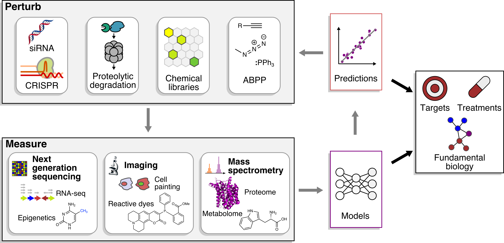

# Research

**We study how pathogenic bacteria survive and infect, using chemical biology and genetic tools to define gene functions and gene-gene interdependencies. Ultimately, we aim to enable antimicrobial therapies which exploit key weaknesses in the ability of pathogenic bacteria to evolve resistance to antibiotics.**

We primarily study Mycobacterium tuberculosis, the causative agent of tuberculosis (TB), a top-10 cause of death globally which kills around 1.5 million people each year.

As soon as new antimicrobial drugs are discovered and used in the clinic, pathogenic bacteria inevitably evolve resistance, driving an unsustainable cycle threatening the twentieth century’s improvements to public health. Antibiotics revolutionized modern medicine, but once again millions of lives are threatened by pathogenic bacteria like M. tuberculosis. 

Working at the interface of genetics, chemistry, and machine learning, we use chemical “probes” or “perturbagens” to systematically and precisely disrupt the cellular machinery of pathogenic bacteria and study the consequences of this disruption on their ability to survive, infect, and resiliently evolve resistance.

With this approach, we seek to bridge the gap between understanding pathogen biology and designing new therapeutic strategies. 

## Approaches

Small molecules complement genetics because they are easily applied to disparate cell types and species, precisely perturb specific functions of multifunctional gene products, and directly bridge the gap between implication of genes in disease and new therapeutics.

Starting with M. tuberculosis, we aim to systematically apply small molecules with diverse cellular targets to define the molecular and systems biology of gene functions essential for pathogen survival during infection.

### Defining genetic interdependencies and gene functions essential for pathogen survival

To a first approximation, genetic perturbation simulates small molecule perturbation of gene products. Quantitative phenotyping of double perturbations (gene-gene interactions and chemical-genetic interactions) reveal functional interdependencies essential for pathogen survival, which remain uncharacterized in most non-model pathogenic bacteria.

### Accelerating discovery of new molecular tools for understanding infection

There are no heuristics analogous to Lipinski’s Rules (forming a cheminformatic definition of “drug-like” molecules) defining the typical chemical space of small molecules which might be active in bacteria. To discover new small molecule perturbagens which act on bacteria against novel targets, we use essential gene mutants’ hypersensitivity toward low potency small molecules both to enable sparse exploration of vast chemical space, and to assign targets to new bioactive small molecules. We also aim to use machine learning to help guide this exploration.

### Defining pharmacological and functional determinants of infection outcomes

Small molecule perturbations can be dynamic and heterogeneous in time and space; these properties match the dynamics and heterogeneity of infection processes. Chemical perturbagens are therefore an invaluable complement to conventional genetics for dissecting dynamic and heterogeneous host-pathogen interactions.